# Introducción a esquemas de nombres, redes, clientes y servicios con Java
## Sebastian Galvis Briceño

## Ejercicio 1
El objetivo es escribir un programa en el cual se cree un objeto URL e imprima en
pantalla cada uno de los datos que retornan los 8 metodos:
- getProtocol()
- getAuthority()
- getHost()
- getPort()
- getPath()
- getQuery()
- getFile()
- getRef()

### Desarrollo:
De acuerdo con la información proporcionada, la implementación fue la siguiente clase:
``` java
import java.net.*;

public class URLInfo {
    public static void main(String[] args) {
        try {
            URL myURL = new URL("http://ldbn.escuelaing.edu.co:80/publications_bib.html?autor=sebastian#seccion1");

            System.out.println("Protocolo: " + myURL.getProtocol());
            System.out.println("Authority: " + myURL.getAuthority());
            System.out.println("Host: " + myURL.getHost());
            System.out.println("Puerto: " + myURL.getPort());
            System.out.println("Path: " + myURL.getPath());
            System.out.println("Query: " + myURL.getQuery());
            System.out.println("File: " + myURL.getFile());
            System.out.println("Ref: " + myURL.getRef());

        } catch (MalformedURLException e) {
            System.out.println("URL mal formada: " + e.getMessage());
        }
    }
}
```

### Resultado:
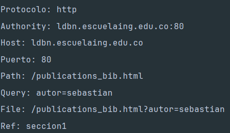

## Ejercicio 2
Escribir una aplicacion browser que pregunte una direccion URL al usuario y que lea datos de esa direccion y que los almacene en un archivo con el nombre
***resultado.html***.

### Desarrollo: 
Se ha implementado la siguiente solución:
``` java
public class MiniBrowser {
    public static void main(String[] args) {
        Scanner scanner = new Scanner(System.in);

        System.out.print("Ingrese la URL (ejemplo: http://www.google.com): ");
        String urlString = scanner.nextLine();

        try {
            URL url = new URL(urlString);

            BufferedReader reader = new BufferedReader(
                    new InputStreamReader(url.openStream())
            );

            BufferedWriter writer = new BufferedWriter(
                    new FileWriter("resultado.html")
            );

            String inputLine;
            while ((inputLine = reader.readLine()) != null) {
                writer.write(inputLine);
                writer.newLine(); 
            }

            reader.close();
            writer.close();

            System.out.println("El contenido de la página se guardó en 'resultado.html'");
            System.out.println("Abra ese archivo en su navegador para ver la página.");

        } catch (MalformedURLException e) {
            System.err.println("La URL está mal formada: " + e.getMessage());
        } catch (IOException e) {
            System.err.println("Error al leer o escribir: " + e.getMessage());
        }
    }
}
```

### Resultado:
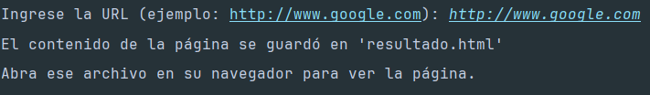
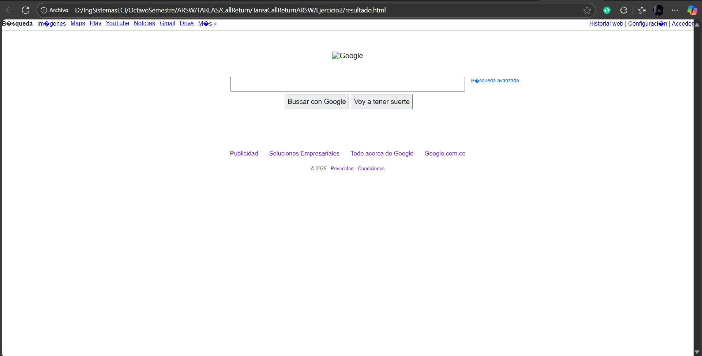

## Ejercicio 3
Escribir un servidor que reciba un número y responda el cuadrado de este número.

### Desarrollo:
Se ha realizado la siguiente implementación:
1. Servidor:
``` java
public class Server {
    public static void main(String[] args) {
        int port = 35000;

        try (ServerSocket serverSocket = new ServerSocket(port)) {
            System.out.println("Servidor iniciado en el puerto " + port);

            while (true) {
                Socket clientSocket = serverSocket.accept();
                System.out.println("Cliente conectado desde " + clientSocket.getInetAddress());

                BufferedReader in = new BufferedReader(
                        new InputStreamReader(clientSocket.getInputStream()));
                PrintWriter out = new PrintWriter(clientSocket.getOutputStream(), true);

                String inputLine = in.readLine();
                System.out.println("Número recibido: " + inputLine);

                try {
                    int numero = Integer.parseInt(inputLine);
                    int cuadrado = numero * numero;

                    out.println("Respuesta: " + cuadrado);
                } catch (NumberFormatException e) {
                    out.println("Error: el valor recibido no es un número válido.");
                }

                clientSocket.close();
            }

        } catch (IOException e) {
            System.out.println("Error en el servidor: " + e.getMessage());
            e.printStackTrace();
        }
    }
}
```
2. Cliente:
``` java
public class Client {
    public static void main(String[] args) {
        String host = "127.0.0.1";
        int port = 35000;

        try (
                Socket socket = new Socket(host, port);
                PrintWriter out = new PrintWriter(socket.getOutputStream(), true);
                BufferedReader in = new BufferedReader(new InputStreamReader(socket.getInputStream()));
                Scanner scanner = new Scanner(System.in);
        ) {
            System.out.print("Ingrese un número: ");
            String numero = scanner.nextLine();

            out.println(numero);

            String respuesta = in.readLine();
            System.out.println("Respuesta del servidor: " + respuesta);

        } catch (UnknownHostException e) {
            System.err.println("No se conoce el host: " + host);
        } catch (IOException e) {
            System.err.println("Error de conexión con el servidor: " + e.getMessage());
        }
    }
}
```

### Resultado:
1. Corremos Server.java:
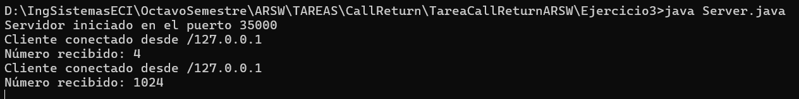
2. Corremos Client.java en otra terminal:
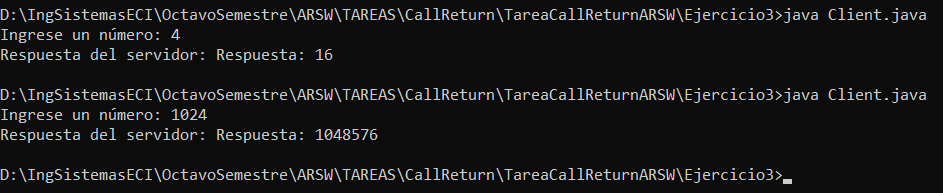

## Ejercicio 4
Escribir un servidor que pueda recibir un número y responda con una operación sobre este número. Este servidor puede recibir un mensaje que empiece por "fun:", si recibe este mensaje cambia la operación a la especificada. El servidor debe responder las funciones seno, coseno y tangente. Por defecto debe empezar calculando el coseno. Por ejemplo, si el primer numero que recibe es 0, debe responder 1, si despues recibe 2 debe responder 0, si luego recibe "fun:sin" debe cambiar la operacion actual a seno, es decir a a partir de ese momento debe calcular senos. Si enseguida recibe 0 debe responder 0.

### Desarrolllo:
La implementación seguida fue la siguiente:

1. Servidor:
``` java
public class Server {
    public static void main(String[] args) {
        int port = 35000;
        String currentFunction = "cos";

        try (ServerSocket serverSocket = new ServerSocket(port)) {
            System.out.println("Servidor de funciones iniciado en el puerto " + port);

            while (true) {
                Socket clientSocket = serverSocket.accept();
                System.out.println("Cliente conectado: " + clientSocket.getInetAddress());

                BufferedReader in = new BufferedReader(
                        new InputStreamReader(clientSocket.getInputStream()));
                PrintWriter out = new PrintWriter(clientSocket.getOutputStream(), true);

                String inputLine;
                while ((inputLine = in.readLine()) != null) {
                    System.out.println("Mensaje recibido: " + inputLine);

                    if (inputLine.startsWith("fun:")) {
                        String func = inputLine.substring(4).trim();
                        if (func.equals("sin") || func.equals("cos") || func.equals("tan")) {
                            currentFunction = func;
                            out.println("Función cambiada a: " + currentFunction);
                        } else {
                            out.println("Función no reconocida. Use sin, cos o tan.");
                        }
                    } else {
                        try {
                            double numero = Double.parseDouble(inputLine);
                            double resultado;

                            switch (currentFunction) {
                                case "sin":
                                    resultado = Math.sin(numero);
                                    break;
                                case "cos":
                                    resultado = Math.cos(numero);
                                    break;
                                case "tan":
                                    resultado = Math.tan(numero);
                                    break;
                                default:
                                    resultado = Double.NaN;
                            }
                            out.println("Respuesta: " + resultado);
                        } catch (NumberFormatException e) {
                            out.println("Error: entrada no válida");
                        }
                    }
                }
                clientSocket.close();
            }

        } catch (IOException e) {
            System.out.println("Error en el servidor: " + e.getMessage());
            e.printStackTrace();
        }
    }
}
```

2. Cliente
``` java
public class Client {
    public static void main(String[] args) {
        String host = "127.0.0.1"; // Servidor local
        int port = 35000;

        try (
                Socket socket = new Socket(host, port);
                PrintWriter out = new PrintWriter(socket.getOutputStream(), true);
                BufferedReader in = new BufferedReader(new InputStreamReader(socket.getInputStream()));
                Scanner scanner = new Scanner(System.in);
        ) {
            System.out.println("Conectado al servidor de funciones.");
            System.out.println("Puede enviar números o cambiar función con 'fun:sin', 'fun:cos', 'fun:tan'.");

            while (true) {
                System.out.print("> ");
                String mensaje = scanner.nextLine();
                out.println(mensaje);

                String respuesta = in.readLine();
                if (respuesta == null) break; // Servidor cerró conexión
                System.out.println(respuesta);
            }

        } catch (IOException e) {
            System.err.println("Error de conexión: " + e.getMessage());
        }
    }
}
```

### Resultado:
Servidor:
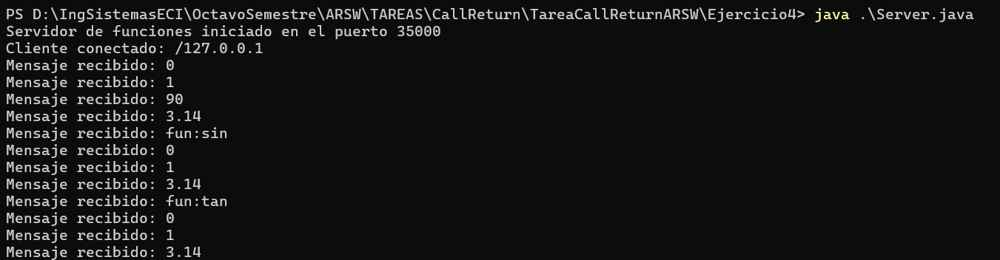
Cliente:
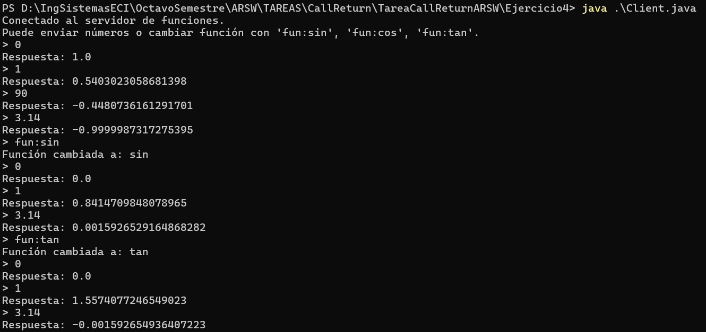


## Ejercicio 5
Implementar el código 4 del archivo y acceder a él desde el navegador
### Desarrollo:
``` java
import java.net.*;
import java.io.*;

public class HttpServer {

    public static void main(String[] args) throws IOException {

        ServerSocket serverSocket = null;
        try{
            serverSocket = new ServerSocket(35000);
        } catch(IOException e){
            System.out.println("Could not listen on port: 35000");
            System.exit(1);
        }

        Socket clientSocket = null;
        try {
            System.out.println("Listo para recibir ...");
            clientSocket = serverSocket.accept();
        } catch(IOException e){
            System.out.println("Accept failed.");
            System.exit(1);
        }

        PrintWriter out = new PrintWriter(clientSocket.getOutputStream(), true);
        BufferedReader in = new BufferedReader(
                new InputStreamReader(
                        clientSocket.getInputStream()));
        String inputLine, outputLine;

        while ((inputLine = in.readLine()) != null) {
            System.out.println("Received: " + inputLine);
            if (!in.ready()) {
                break;
            }
        }

        outputLine = "<!DOCTYPE html>"
                + "<html>"
                + "<head>"
                + "<meta charset=\"UTF-8\">"
                + "<title>Title of the document</title>"
                + "</head>"
                + "<body>"
                + "My Web Site"
                + "</body>"
                + "</html>" + inputLine;
        out.println(outputLine);

        out.close();
        in.close();
        clientSocket.close();
        serverSocket.close();
    }
}
```

### Resultado:
Al acceder a http://localhost:35000/, se muestra lo siguiente en la consola:
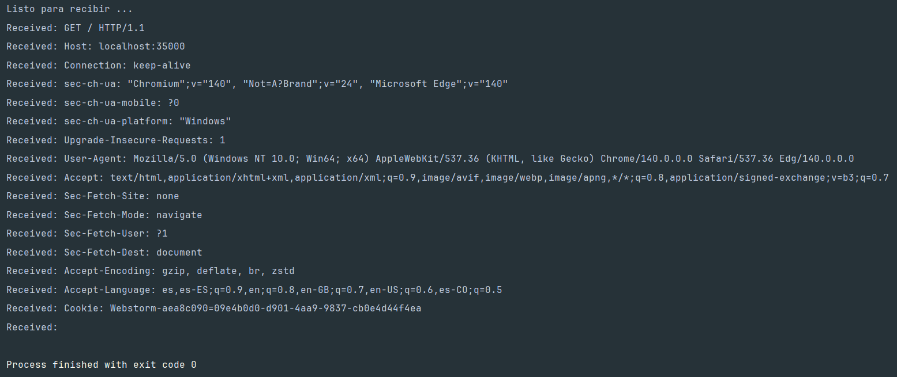

## Ejercicio 6
Escribir un servidor web que soporte multiples solicitudes seguidas (no concurrentes). El servidor debe retornar todos los archivos solicitados, incluyendo páginas html e imagenes.
### Desarrollo:
La solución implementada fue la siguiente:
``` java
public class WebServer {
    public static void main(String[] args) {
        int port = 35000;

        try (ServerSocket serverSocket = new ServerSocket(port)) {
            System.out.println("Servidor web iniciado en http://localhost:" + port);

            while (true) {
                Socket clientSocket = serverSocket.accept();
                System.out.println("Cliente conectado: " + clientSocket.getInetAddress());

                BufferedReader in = new BufferedReader(
                        new InputStreamReader(clientSocket.getInputStream()));
                OutputStream out = clientSocket.getOutputStream();

                String requestLine = in.readLine();
                if (requestLine == null) {
                    clientSocket.close();
                    continue;
                }

                System.out.println("Solicitud: " + requestLine);

                String[] parts = requestLine.split(" ");
                if (parts.length < 2) {
                    clientSocket.close();
                    continue;
                }

                String path = parts[1];
                if (path.equals("/")) {
                    path = "/index.html";
                }

                File file = new File("." + path);

                if (file.exists() && !file.isDirectory()) {
                    String contentType = Files.probeContentType(file.toPath());
                    if (contentType == null) {
                        contentType = "application/octet-stream";
                    }

                    byte[] fileData = Files.readAllBytes(file.toPath());
                    String header = "HTTP/1.1 200 OK\r\n" +
                            "Content-Type: " + contentType + "\r\n" +
                            "Content-Length: " + fileData.length + "\r\n" +
                            "\r\n";

                    out.write(header.getBytes());
                    out.write(fileData);

                } else {
                    String errorMessage = "<h1>404 - Not Found</h1>";
                    String header = "HTTP/1.1 404 Not Found\r\n" +
                            "Content-Type: text/html\r\n" +
                            "Content-Length: " + errorMessage.length() + "\r\n" +
                            "\r\n";
                    out.write(header.getBytes());
                    out.write(errorMessage.getBytes());
                }

                out.flush();
                clientSocket.close();
            }

        } catch (IOException e) {
            System.err.println("Error en el servidor: " + e.getMessage());
        }
    }
}
```
### Resultado:
Podemos apreciar que, tal y como el enunciado lo pide, el servidor acepta múltiples solicitudes seguidas una tras otra, sin importar cuantas sean (No confundir con concurrentes):

Servidor:
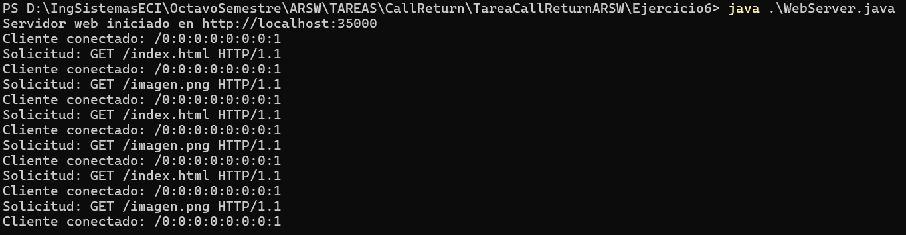
Navegador web:


## Ejercicio 7
Utilizando Datagramas escribir un programa que se conecte a un servidor que responde la hora actual en el servidor. El programa debe actualizar la hora cada 5 segundos según los datos del servidor. Si una hora no es recibida debe mantener la hora que tena. Para la prueba se apagará el servidor y después de unos segundos se reactivará. El cliente debe seguir funcionando y actualizarse cuando el servidor esté nuevamente funcionando.
### Desarrollo:
La implementación a seguir fue la siguiente:

Servidor:
``` java
public class UDPServer {

    public static void main(String[] args) {
        int puerto = 9999;

        try {
            DatagramSocket socket = new DatagramSocket(puerto);
            System.out.println("Servidor UDP iniciado en el puerto " + puerto);

            byte[] buffer = new byte[1024];

            while (true) {
                DatagramPacket peticion = new DatagramPacket(buffer, buffer.length);
                socket.receive(peticion);

                String mensaje = new String(peticion.getData(), 0, peticion.getLength());
                System.out.println("Mensaje recibido: " + mensaje);

                if (mensaje.equalsIgnoreCase("hora")) {
                    String hora = LocalTime.now().format(DateTimeFormatter.ofPattern("HH:mm:ss"));

                    InetAddress direccion = peticion.getAddress();
                    int puertoCliente = peticion.getPort();

                    byte[] respuesta = hora.getBytes();
                    DatagramPacket paqueteRespuesta = new DatagramPacket(
                            respuesta, respuesta.length, direccion, puertoCliente);

                    socket.send(paqueteRespuesta);
                    System.out.println("Hora enviada: " + hora);
                }
            }
        } catch (Exception e) {
            System.out.println("Error en el servidor: " + e.getMessage());
        }
    }
}
```

Cliente:
``` java
public class UDPClient {

    public static void main(String[] args) {
        String host = "127.0.0.1";
        int puerto = 9999;
        String horaActual = "No disponible";

        try {
            DatagramSocket socket = new DatagramSocket();
            socket.setSoTimeout(3000);

            while (true) {
                try {
                    String mensaje = "hora";
                    byte[] buffer = mensaje.getBytes();

                    InetAddress direccion = InetAddress.getByName(host);
                    DatagramPacket peticion = new DatagramPacket(buffer, buffer.length, direccion, puerto);
                    socket.send(peticion);

                    byte[] bufferRespuesta = new byte[1024];
                    DatagramPacket respuesta = new DatagramPacket(bufferRespuesta, bufferRespuesta.length);
                    socket.receive(respuesta);

                    horaActual = new String(respuesta.getData(), 0, respuesta.getLength());
                    System.out.println("Hora recibida del servidor: " + horaActual);

                } catch (java.net.SocketTimeoutException e) {
                    System.out.println("Servidor no respondió. Manteniendo: " + horaActual);
                }

                // Esperar 5 segundos antes de la siguiente consulta
                Thread.sleep(5000);
            }

        } catch (Exception e) {
            System.out.println("Error en el cliente: " + e.getMessage());
        }
    }
}
```
### Resultado:
Servidor:
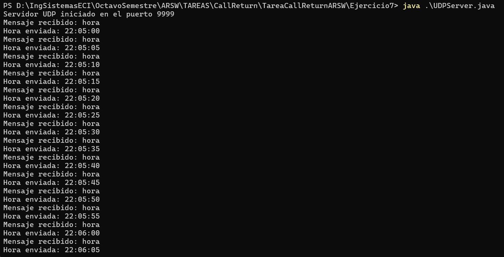
Cliente:

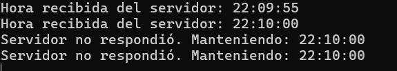
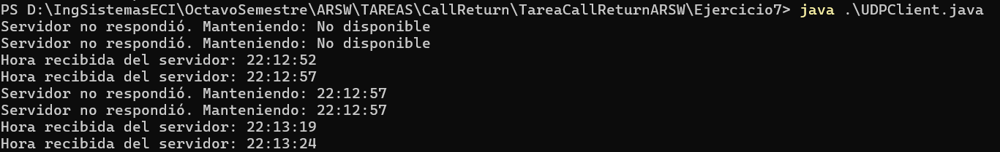

## Ejercicio 8

### Desarrollo:

### Resultado:


## Ejercicio 9

### Desarrollo:

### Resultado:
