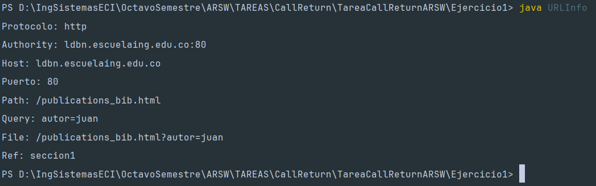
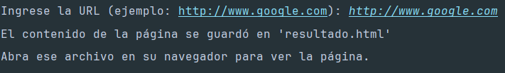
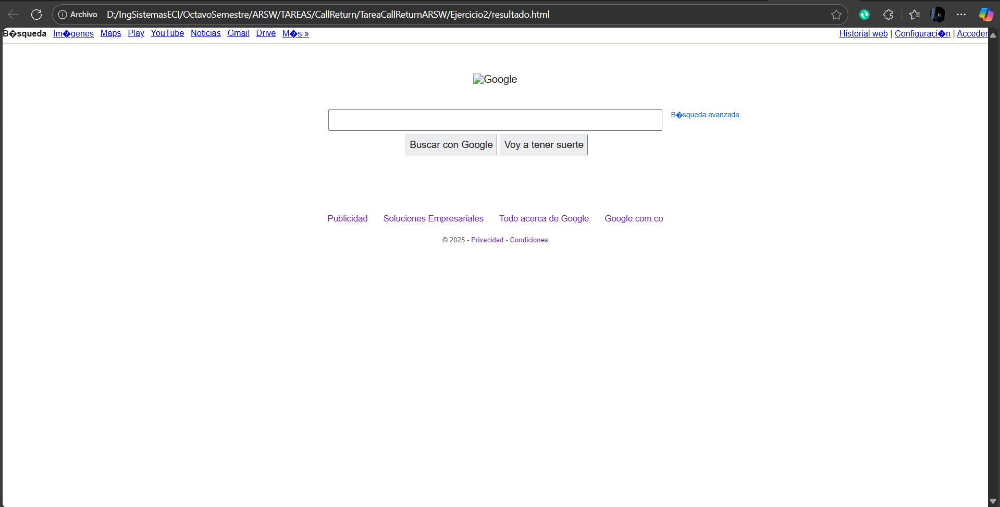
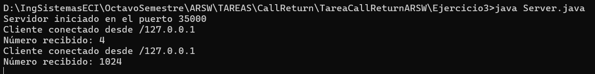
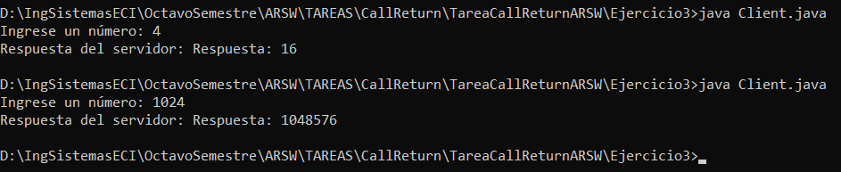

# Introducción a esquemas de nombres, redes, clientes y servicios con Java
## Sebastian Galvis Briceño

## Ejercicio 1
El objetivo es escribir un programa en el cual se cree un objeto URL e imprima en
pantalla cada uno de los datos que retornan los 8 metodos:
- getProtocol()
- getAuthority()
- getHost()
- getPort()
- getPath()
- getQuery()
- getFile()
- getRef()

### Desarrollo:
De acuerdo con la información proporcionada, la implementación fue la siguiente clase:
``` java
import java.net.*;

public class URLInfo {
    public static void main(String[] args) {
        try {
            URL myURL = new URL("http://ldbn.escuelaing.edu.co:80/publications_bib.html?autor=sebastian#seccion1");

            System.out.println("Protocolo: " + myURL.getProtocol());
            System.out.println("Authority: " + myURL.getAuthority());
            System.out.println("Host: " + myURL.getHost());
            System.out.println("Puerto: " + myURL.getPort());
            System.out.println("Path: " + myURL.getPath());
            System.out.println("Query: " + myURL.getQuery());
            System.out.println("File: " + myURL.getFile());
            System.out.println("Ref: " + myURL.getRef());

        } catch (MalformedURLException e) {
            System.out.println("URL mal formada: " + e.getMessage());
        }
    }
}
```

### Resultado:


## Ejercicio 2
Escribir una aplicacion browser que pregunte una direccion URL al usuario y que lea datos de esa direccion y que los almacene en un archivo con el nombre
***resultado.html***.

### Desarrollo: 
Se ha implementado la siguiente solución:
``` java
public class MiniBrowser {
    public static void main(String[] args) {
        Scanner scanner = new Scanner(System.in);

        System.out.print("Ingrese la URL (ejemplo: http://www.google.com): ");
        String urlString = scanner.nextLine();

        try {
            URL url = new URL(urlString);

            BufferedReader reader = new BufferedReader(
                    new InputStreamReader(url.openStream())
            );

            BufferedWriter writer = new BufferedWriter(
                    new FileWriter("resultado.html")
            );

            String inputLine;
            while ((inputLine = reader.readLine()) != null) {
                writer.write(inputLine);
                writer.newLine(); 
            }

            reader.close();
            writer.close();

            System.out.println("El contenido de la página se guardó en 'resultado.html'");
            System.out.println("Abra ese archivo en su navegador para ver la página.");

        } catch (MalformedURLException e) {
            System.err.println("La URL está mal formada: " + e.getMessage());
        } catch (IOException e) {
            System.err.println("Error al leer o escribir: " + e.getMessage());
        }
    }
}
```

### Resultado:



## Ejercicio 3
Escribir un servidor que reciba un número y responda el cuadrado de este número.

### Desarrollo:

### Resultado:
1. Corremos Server.java:

2. Corremos Client.java:

